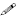

How To Install An Export XML File From This Repository
======================================================

You need __Division__ level access to create an export.

Once you create an export, you can then run that export manually or as an automatic job.

Some vendors require multiple integration files - each file will require it's own separate export, it's own XML file, and it's own _job_ (if you intend to automate the export).

## Check to see if you need to customize the XML file for your organization
Some XML files in this repository require you to customize them with your own customer ID, vendor ID, or tenant ID, so that third party vendors can identify that the resulting file came from your school or school division.

You will find comments in the XML files wherever these customizations are required. For example, the Clevr files require a "tenandID" field unique to each customer:

```xml
<!-- Clevr Tenant ID -->   
<!-- 
    EXPORT CUSTOMIZATION REQUIRED
    =============================
    Clevr uses this field to identify which customer an integration file belongs to.
    You will need to edit this value to match your Clevr tenant ID, or it will cause errors 
    when the export file is imported into Clevr.
-->    
<constant value="YOURTENANTIDHERE" header-source="constant" header-value="tenantId" />
```
For example, if your Clevr tenant ID is "1234", you should edit this line in the XML file to read:
```xml
<constant value="1234" header-source="constant" header-value="tenantId" />
```

## Creating the export in MySchoolSask

### Create export by uploading an XML file from your computer
1. Go to the __Division__ view
2. Go to the __Tools__ top-tab
3. Go to the __Exports__ side-tab
4. Click __Options__
5. Click __Add__
6. Give your export a meaningful name (example: LSSD Clevr Student File)
7. Give your export a unique _Definition ID_ (example: LSSD-CLEVR-STUDENTS)
8. If you intend your export to be run automatically, check the __Schedulable__ checkbox
9. In the __XML definition__ field, click the __upload__ icon 
10. Click the __Choose File__ button
11. Select the XML file you wish to use for this export
12. Click __Import__
13. Click __Save__
14. Now you can [Run your export](HowToRunAnExportManually.md) or [Create an automated job](HowToRunAnExportAutomatically.md) to run your export on a schedule.

### Create export by copying and pasting XML code
1. Go to the __Division__ view
2. Go to the __Tools__ top-tab
3. Go to the __Exports__ side-tab
4. Click __Options__
5. Click __Add__
6. Give your export a meaningful name (example: LSSD Clevr Student File)
7. Give your export a unique _Definition ID_ (example: LSSD-CLEVR-STUDENTS)
8. If you intend your export to be run automatically, check the __Schedulable__ checkbox
9. In the __XML definition__ field, click the __Edit__ icon 
10. Copy the contents of the XML file from this repository, or from your computer, into the text box in the pop-up window that appears
11. Make any adjustments or customizations that you may need to make
12. Click __Validate__ to ensure the XML file is formatted correctly
13. Click __OK__
14. Click __Save__
15. Now you can [Run your export](HowToRunAnExportManually.md) or [Create an automated job](HowToRunAnExportAutomatically.md) to run your export on a schedule.

